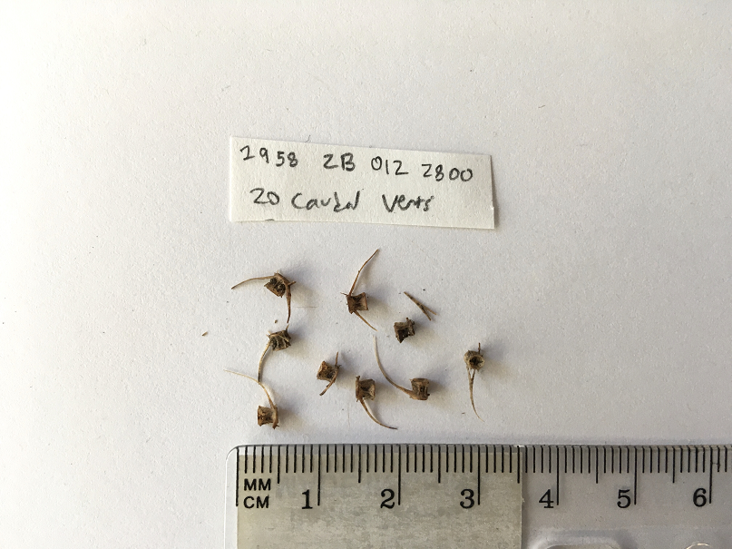

# Hybridization capture of ancient DNA 

This repository contains the scripts that were used in the manuscript *"Hybridization capture of ancient DNA reveals harvest of winter-spawning herring populations by Coast Salish fisheries over 900 years"*.

## Study Overview

The extent to which different populations or phenotypes contribute to ecosystem goods over long time scales is mostly unknown. Temporal studies of population diversity are particularly important in forage fish such as Pacific herring, as they are foundational to coastal food webs, cultures, and economies. In this study, we investigated the relative contributions of genetically distinct herring populations to food supplies over the last millennium, using ancient DNA extracted from herring bones (N = 44) excavated from the Burton Acres archaeological site in Puget Sound, Washington. We applied hybridization capture techniques to genotype approximately 5,000 SNPs in ancient samples and identify herring populations harvested by Coast Salish fishers over a period of approximately 900 years. 

## Directory structure
