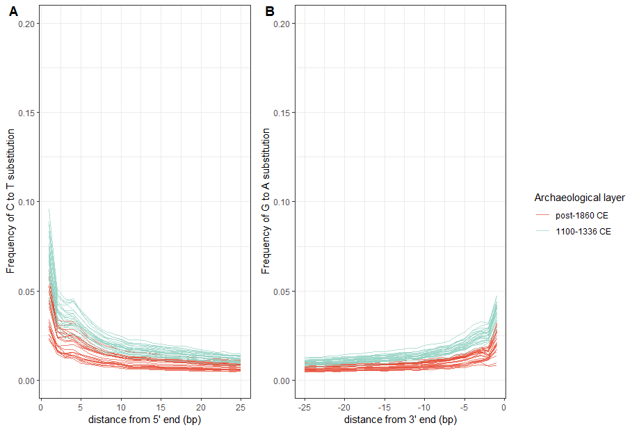

# Visualize damage at ends of aDNA samples using *mapDamage*

DNA extracted from historical or ancient samples has been degraded by the passage of time and environmental conditions. In general, aDNA fragments are short and there may be atypical nucleotide bases in the sequence due to oxidative and hydrolytic degradation. Nucleotide misincorporation patterns are caused by deaminated forms of cytosines (uracils); Jonsson et al. (2013) write: *"For instance, for one of the most popular protocols (Meyer and Kircher, 2010), we observe inflated cytosine deamination rates at 5'-overhangs, an increase in C -->T substitution rates toward sequencing starts and complementary increase in G -->A rates toward reads ends (Briggs et al., 2007)."* 

*mapDamage2* is a program which quantifies DNA damage patterns in ancient DNA sequences generated by high throughput sequencing. Real aDNA sequences should have some level of nucleotide misincorporation, and quantifying this is a way to authenticate that sequences represent aDNA and not exogeneous DNA contamination.

To learn how to install *mapDamage2* program, follow this link: https://ginolhac.github.io/mapDamage/
For the *mapDamage2* manuscript, go here: https://academic.oup.com/bioinformatics/article/29/13/1682/184965

## Run mapDamage2

Usage: *mapDamage [options] -i BAMfile -r reference.fasta*

Options for rescaling of BAM files:

  --rescale                     Rescale the quality scores in the BAM file using the output from the statistical estimation
  
  --rescale-out=<filename>    Write the rescaled BAM to this file
  
  --folder=<foldername> write the results to this folder

``` bash

# Directories and files

BASEDIR=/media/ubuntu/Herring_aDNA/hybridization_capture/ancient_samples
SAMPLELIST=$BASEDIR/sample_lists/sample_list.txt # Path to a text file with list of prefixes of the fastq files, separated by newline s
BAMDIR=$BASEDIR'/'bam # path to folder with bam files (output)
GENOMEDIR=/media/ubuntu/Herring_aDNA/atlantic_herring_genome # Path to genome.
GENOME=GCA_900700415.1_Ch_v2.0.2_genomic.fna #file name of genome
OUTDIR=$BASEDIR'/'mapdamage_bam

# Command to run mapDamage

for SAMPLEFILE in `cat $SAMPLELIST`
do
  mapDamage -i $BAMDIR'/'${SAMPLEFILE}'_sorted_rd.bam' \
  -r $GENOMEDIR'/'$GENOME \
  --rescale \
  --rescale-out=$OUTDIR'/'${SAMPLEFILE}'_sorted_rd_realign.bam' \
  --folder=$OUTDIR'/''results_'${SAMPLEFILE}
done

# Append the output of mapDamage to some text files for plotting all samples together

cd $OUTDIR #change to the directory containing the mapDamage results

for FOLDER in */ #for every folder in the current directory
do
  echo ${FOLDER} # check
  #remove the header in this file
	grep -v "pos" ${FOLDER}'/''3pGtoA_freq.txt' | \
	#append the remaining lines to a new file  
	cat  >>'3pGtoA_freq_allsamples.txt'
done


for FOLDER in */ #for every folder in the current directory
do
  echo ${FOLDER} # check
  #remove the header in this file
	grep -v "pos" ${FOLDER}'/''5pCtoT_freq.txt' | \
	#append the remaining lines to a new file  
	cat  >>'5pCtoT_freq_allsamples.txt'
done


```

## Plot output of mapDamage

I plotted the estimated 5' and 3' misincorporation frequency using an R script: [plot_mapdamage.R](plot_mapdamage.R)

``` {r}
# Load libraries
library(tidyverse)
library(cowplot)

##########################################################################
# Specify some directories

base.dir <- "G:/hybridization_capture/ancient_samples" #base directory
mapdamage.dir <- "mapdamage_bam" # folder containing mapdamage results
sample.dir <- "sample_lists" # folder containing list of samples

out.file <- "mapdamage_plot.pdf" #name of plot to save at the end

#Specify the file names containing aggregated mapDamage results

in.file1 <- "5pCtoT_freq_allsamples.txt"
in.file2 <- "3pGtoA_freq_allsamples.txt"
in.file3 <- "sample_list.txt"

##########################################################################
# read in data

fivep.df<- read.delim(paste0(base.dir, "/", mapdamage.dir, "/", in.file1), header = FALSE, col.names = c("pos", "misincorporation"))
threep.df<- read.delim(paste0(base.dir, "/", mapdamage.dir, "/", in.file2), header = FALSE, col.names = c("pos", "misincorporation"))
sample.df <- read.delim(paste0(base.dir, "/", sample.dir, "/", in.file3), header = FALSE, col.names = c("sample"))

# format data for plotting

n.bases <- 25 # mapDamage looks at the first (or last) 25 bases from the 5' or 3' end of sequence

sample <- sample.df$sample %>% #vector of sample names
  rep(n.bases) %>% #repeat this vector by the number of bases in mapDamage
  sort() %>% #sort alphabetically (A to Z)
  as.vector() #save output as vector


fivep.df <- cbind(fivep.df, sample)

fivep.df <- fivep.df %>%
  separate(sample, into = c("layer", "i"), remove = FALSE) #get arch layer data for plotting

threep.df <- cbind(threep.df, sample)

threep.df <- threep.df %>%
  separate(sample, into = c("layer", "i"), remove = FALSE) %>% #get arch layer data for plotting
  mutate(pos2 = -pos) #add an extra column with neg sign in pos, for plotting

# plot

plot1 <- ggplot()+
  geom_line(data = fivep.df, aes(x= pos, y = misincorporation, group = sample, color = layer), alpha = 0.7)+
  ylim(0,0.2)+
  ylab('Frequency of C to T substitution')+
  xlab("distance from 5' end (bp)")+
  theme_bw()+
  scale_color_manual(name = "Archaeological layer", 
                     values = c("#E64B35B2", "#91D1C2B2"), 
                     labels = c("post-1860 CE", "1100-1336 CE"))


plot2 <- ggplot()+
  geom_line(data = threep.df, aes(x= pos2, y = misincorporation, group = sample, color = layer), alpha = 0.7)+
  ylim(0,0.2)+
  ylab('Frequency of G to A substitution')+
  xlab("distance from 3' end (bp)")+
  theme_bw()+
  scale_color_manual(name = "Archaeological layer", 
                     values = c("#E64B35B2", "#91D1C2B2"), 
                     labels = c("post-1860 CE", "1100-1336 CE"))

plot_grid(plot1, plot2, align = "h")


# arrange the  plots in a single row
prow <- plot_grid(
  plot1 + theme(legend.position="none"),
  plot2 + theme(legend.position="none"),
  align = 'vh',
  labels = c("A", "B"),
  hjust = -1,
  nrow = 1
)

prow


# extract the legend from one of the plots
legend <- get_legend(
  # create some space to the left of the legend
  plot1 + theme(legend.box.margin = margin(0, 0, 0, 12))
)

# add the legend to the row we made earlier. Give it one-third of 
# the width of one plot (via rel_widths).
final.plot <- plot_grid(prow, legend, rel_widths = c(3, .75))
final.plot

# save the output

ggsave(out.file, plot = final.plot, path = paste0(base.dir, "/", mapdamage.dir))

```

The resulting plot shows that the older samples have more damage near the ends of sequences, as expected. 




