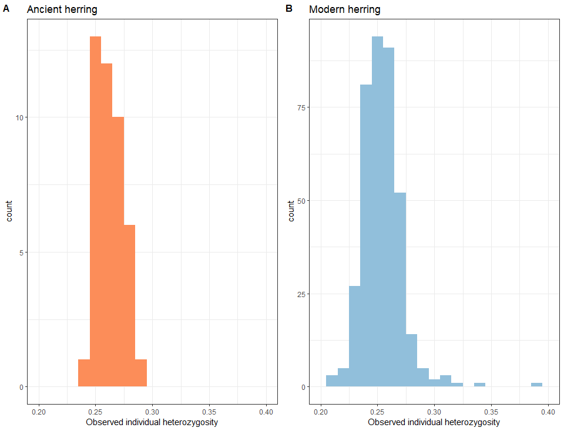

# Calculate individual observed heterozygosity

As a quality-control check (to verify that heterozygous sites were not being undercalled in the ancient samples), I decided to calculate individual observed heterozygosity 
for the ancient samples and modern samples. Here is what I did:

## Estimate individual observed heterozygosity using vcftools --het function

``` bash

# Use vcftools to estimate individual heterozygosity in modern and ancient samples. This script shows how I did it for the modern samples (prefix 0003)

# Specify the directory names and file names
BASEDIR=/media/ubuntu/Herring_aDNA/hybridization_capture/merged_analyses #base directory
VCFDIR=$BASEDIR'/'variants_filtered #vcf directory
OUTDIR=$BASEDIR'/'heterozygosity # directory where output files should be saved

INFILE=0003.filt.HWE.recode.vcf #name of input vcf 
OUTFILE=0003.filt.HWE #"base name" of output vcf (without .recode.vcf file extension)

######
vcftools --vcf $VCFDIR'/'$INFILE \
--het \
--out $OUTDIR'/'$OUTFILE

```

## plot the distribution of individual heterozygosity using R 

``` r
# The purpose of this script is to make plots of individual heterozygosity calculated by vcftools --het

# Load libraries
library(tidyverse)
library(cowplot)

# Specify the directory containing the data tables:
DATADIR <- "G:/hybridization_capture/merged_analyses/heterozygosity"

# Setwd
setwd(DATADIR)

# specify input and output file names:
ancient_file <- "0002.filt.HWE.het" 
modern_file <- "0003.filt.HWE.het"

outfile <- "observed_heterozygosity.pdf"
  
# read in the data
ancient_df <- read.delim(ancient_file)
modern_df <- read.delim(modern_file)  

# calculate observed heterozygosity for each dataframe

ancient_df <- ancient_df %>%
  mutate(N_HET = (N_SITES-O.HOM.)) %>%
  mutate(OBS_HET = N_HET/N_SITES)

modern_df <- modern_df %>%
  mutate(N_HET = (N_SITES-O.HOM.)) %>%
  mutate(OBS_HET = N_HET/N_SITES)

# Plot the observed heterozygosity for each collection

(plot_anc <- ggplot(ancient_df, aes(x = OBS_HET)) +
  geom_histogram(binwidth = 0.01, fill = "#fc8d59") +
  theme_bw() +
  xlab("Observed individual heterozygosity") +
  xlim(0.20, 0.40) +
  ggtitle("Ancient herring"))

(plot_mod <- ggplot(modern_df, aes(x = OBS_HET)) +
  geom_histogram(binwidth = 0.01, fill = "#91bfdb") +
  theme_bw()+
  xlab("Observed individual heterozygosity")+
  xlim(0.20, 0.40)+
  ggtitle("Modern herring"))


# Merge the plots

(multi_plot <- plot_grid(plot_anc, plot_mod, labels = c('A', 'B'), label_size = 12))


# save plot to pdf file

ggsave(outfile,
  plot = multi_plot)
```

## Take a look at the resulting plots

The distribution of observed heterozygosity is quite similar in the modern and ancient samples. Hurray!


